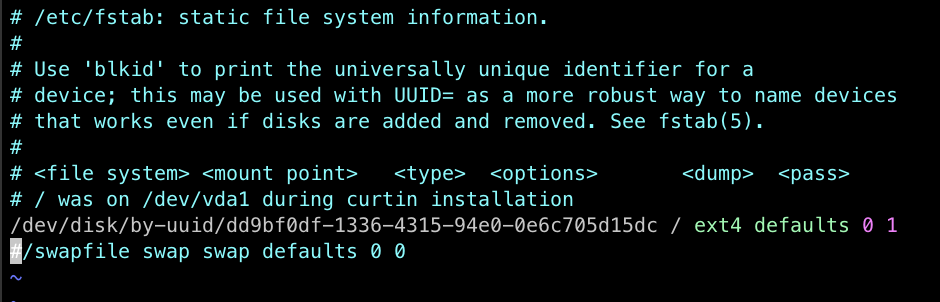
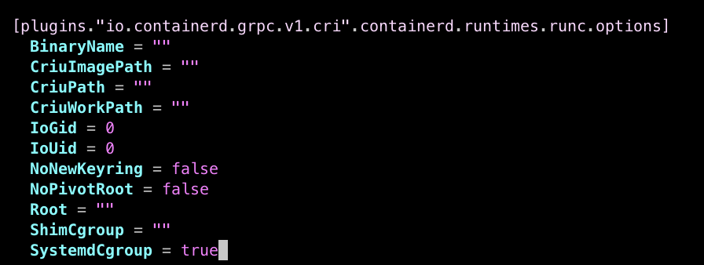
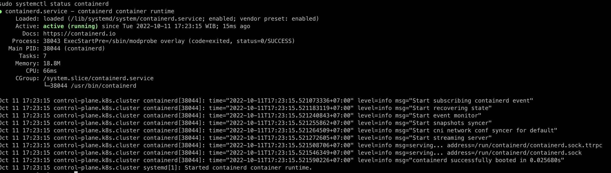
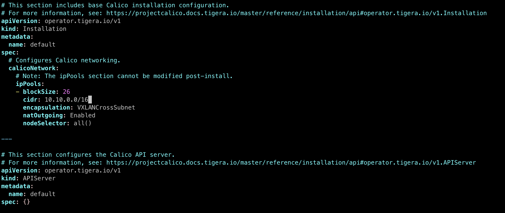
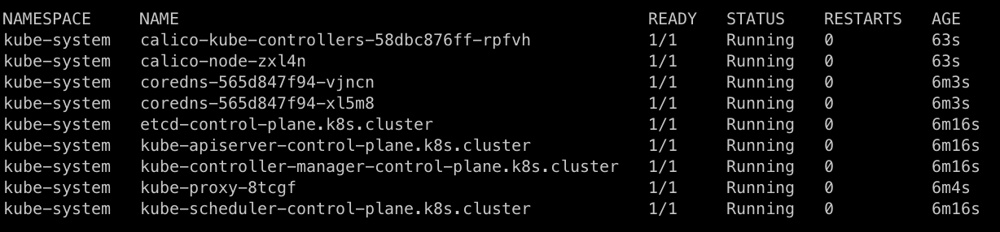
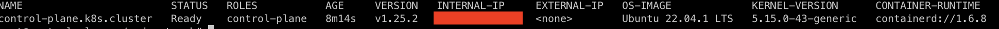
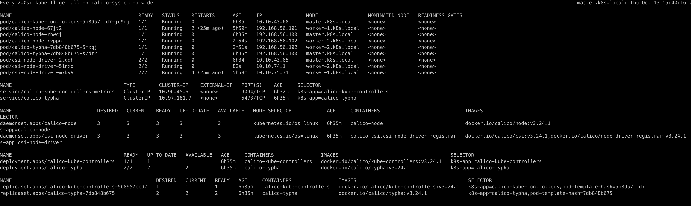

# Implementasi Kluster Kubernetes (Single Node) #
Pada guidelines ini, saya akan mencoba menjelaskan bagaimana cara kita membuat kluster kubernetes (Single Node) dengan mudah dari 0.

Salah satu alasan mengapa saya menggunakan metode ini (dimana banyak beberapa distribusi kubernetes lainnya, seperti *k8s, microk8s, kind, dsb*) adalah saya ingin mencoba mempelajari beberapa dasar dari teknologi kubernetes. Serta tidak dibatasi oleh aturan distribusi.

Berbeda dengan distribusi lainnya, dimana mereka sudah mempackage kubernetes menjadi satu dan kita harus mengikuti arahan atau *rules* sesuai dengan distribusi tersebut.

Jadi, saya putuskan untuk belajar dari 0 untuk membuat kluster kubernetes ini. Sebagai tambahan, mohon maaf jika guidelines ini jauh dari *best-practice* dan kurang baik untuk diimplementasikan di *production*. Oleh karenanya, saya sangat terbuka untuk setiap kritik dan sarannya. (*Catatan: untuk kritik dan saran, mohon gunakan fitur issue di github*)

Oke, tanpa bertele-tele, let's begin!

> NB: Sekali lagi, mohon perhatikan bahwa guidelines ini ditujukan untuk pembuatan *Single Node* kluster. Untuk implementasi kluster *High Availabilty (HA)* atau *multi-node*, maka guidelines ini kurang cocok untuk dipraktekan. Kamu dapat mencari beberapa artikel terkait implementasi *HA Cluster*. (Lain waktu, saya akan mencoba mempelajari mengenai *HA* dan akan mengupdate guidelinesnya pada repo ini)

## Informasi Versi ##
- Kubeadm/Kubernetes Version: `1.25.2`
- Kubectl Version: `1.25.2`
- Kubelet Version: `1.25.2`
- Containerd Version: `1.6.8`

## Pra-Syarat ##
Sebelum kita melakukan setup kluster kubernetes, mohon diingat bahwa saya menggunakan *OS Ubuntu* dalam tutorial ini. Jika kamu menggunakan OS lain, jangan sungkan untuk membuat issue/*feedback* baru sebagai bahan untuk mengupdate dokumentasi ini.

- [Kebutuhan Minimum Sistem](#kebutuhan-minimum-sistem)
  - [Control Plane](#control-plane)
  - [Worker Node](#worker-node)
- [Konfigurasi Network](#konfigurasi-network)
- [Port dan Firewall](#port-dan-firewall)
- [Jumlah Mesin (Node)](#jumlah-mesin-node)

### Kebutuhan Minimum Sistem ###
Dibawah ini adalah kebutuhan minimum sistem agar kluster berjalan maksimal.

#### Control Plane ####
Untuk kebutuhan **Control Plane**, diambil dari dokumentasi resmi kubernetes dan *preflight check*-nya, maka kebutuhan minimum sistemnya adalah sebagai berikut:
- CPU/vCPU: `2 core`
- Memory: `2GB`
- Storage: `> 40GB`

#### Worker Node ####
Dan untuk *worker node*-nya:
- CPU/vCPU: `1 core`
- Memory: `1GB`
- Storage: `> 20GB`

### Konfigurasi Network ####
Pastikan kamu mempunyai *network interface* yang membolehkan traffic internet dan mempunyai public IP. (Karena akan dilakukan proses download *image*, *join cluster* dan sebagainya)

### Port dan Firewall ###
Agar menjadikan kluster lebih aman, sebaiknya kamu menghidupkan firewall. Sebagai contoh disini, saya menggunakan *UFW* sebagai firewall tools.

#### 1. (Optional) Instsall UFW ####
```bash
sudo apt install ufw
```

#### 2. Aktifkan UFW dan port SSH ####
```bash
sudo ufw allow ssh
sudo ufw enable
```

### Jumlah Mesin (Node) ###
Pada guidelines ini, saya akan menggunakan beberapa mesin/*node*, yaitu:
- **1 Node Control Plane**
- **1 Node Worker**

Dengan memenuhi standar sistem diatas.

---

Selanjutnya, mari kita mulai dengan melakukan *basic* setup pada setiap mesin/*node/OS*. (**Control Plane** dan **Wroker**)

## Step 1: Update OS ##
Sebelumnya, kita perlu memastikan bahwa OS kita sudah dalam kondisi terkini.
```bash
sudo apt update -y && sudo apt upgrade -y
```

## Step 2: Update Timezone ##
Untuk memastikan bahwa timezone kita telah tepat, kita perlu melakukan setup timezone. Hal ini diperlukan di *production* saat kita akan melakukan cek log dan sebagainya.
```bash
sudo timedatectl set-timezone Asia/Jakarta
```

## Step 3: Install beberapa Utilitasi OS ##
Opsional, namun dapat membantu kita untuk melakukan *maintainenance* server.
```bash
sudo apt install iputils-ping
```

## Step 4: Disable Swap ##
Merujuk laman resmi kubernetes, untuk kubernetes versi terkini, kita perlu men-*disable* sistem swap pada OS Linux.

### Tambahkan komentar pada konfigurasi swap ###
Didalam file `/etc/fstab`, kamu perlu memberikan komentar pada baris swap. Hal ini dibutuhkan untuk mematikan sistem swap secara permanen.
```bash
sudo vi /etc/fstab
```


### Apply ###
Kemudian, jalankan perintah berikut untuk mengimplementasinya:
```bash
sudo swapoff -a
free -h
```

## Step 5: Set Hostname ##
Selanjutnya, kita perlu memberikan *hostname* pada setiap nodes kita. (Ingat, *hostname* harus berbeda pada setiap *node*)
```bash
sudo hostnamectl set-hostname <hostname>
```

Sebagi contoh:
```bash
sudo hostnamectl set-hostname control-plane
```

## Step 6: Edit file hosts ##
Selanjutnya, kita harus mengubah file `hosts` pada setiap node.
```bash
sudo vi /etc/hosts
```
> PENTING: Khusus untuk node **Control Plane**, kamu harus menambahkan host dari setiap **Node Worker** yang nantinya ingin *join* pada kluster ini.

Setelah itu, untuk menge*test*nya, kamu dapat melakukan *ping* untuk mengecek koneksi:
```bash
ping control-plane
```

## Step 7: Forward IPv4 dan trafik bridge ##
Sesuai dengan dokumentasi kubernetes, hal ini perlu dilakukan agar kluster berjalan dengan baik.
```bash
cat <<EOF | sudo tee /etc/modules-load.d/k8s.conf
overlay
br_netfilter
EOF

sudo modprobe overlay
sudo modprobe br_netfilter

cat <<EOF | sudo tee /etc/sysctl.d/k8s.conf
net.bridge.bridge-nf-call-iptables  = 1
net.bridge.bridge-nf-call-ip6tables = 1
net.ipv4.ip_forward                 = 1
EOF

sudo sysctl --system
```

## Step 8: Allow Firewall ##
Pada step ini, kita akan meng-*allow* semua node untuk saling berhubungan.

### Pada kedua node (control plane dan worker) ###
```bash
sudo ufw allow from <alamat-ip-node-control-plane-atau-worker>
```

Final Check:
```bash
sudo ufw list
```
> Pastikan bawah pada node **Control Plane**, meng-allow alamat IP setiap node **Worker**
> Pastikan bawah pada setiap node **Worker**, meng-allow alamat IP setiap node **Control Plane**

## Step 9: Install CRI (Container Runtime Inteface) ##
Pada tutorial ini, saya menggunakan **Containerd** sebagai CRI. Kamu bisa menggunakan CRI lain seperti *Docker, CRI-O* dengan mengikuti masing-masing guide.

### Install Containerd ###
```bash
sudo apt update
sudo apt install \
    ca-certificates \
    curl \
    gnupg \
    lsb-release

sudo mkdir -p /etc/apt/keyrings
curl -fsSL https://download.docker.com/linux/ubuntu/gpg | sudo gpg --dearmor -o /etc/apt/keyrings/docker.gpg
echo \
  "deb [arch=$(dpkg --print-architecture) signed-by=/etc/apt/keyrings/docker.gpg] https://download.docker.com/linux/ubuntu \
  $(lsb_release -cs) stable" | sudo tee /etc/apt/sources.list.d/docker.list > /dev/null
sudo apt update
sudo apt install containerd.io
```

### Konfigurasi Containerd ###
```bash
sudo containerd config default | sudo tee /etc/containerd/config.toml
sudo vi /etc/containerd/config.toml
```

Cari "**SystemdCgroup**" dan ubah menjadi "**true**" (tanpa tanda kutip dua)


## Restart Containerd dan Cek Status ##
```bash
sudo systemctl restart containerd
sudo systemctl enable --now containerd
sudo systemctl status containerd
```


## Step 10: Install Kubernetes tools ##
Kita akan menginisiasi atau join kluster menggunakan `kubeadm`, jadi:
```bash
sudo apt update
sudo apt install -y apt-transport-https ca-certificates curl

sudo curl -fsSLo /usr/share/keyrings/kubernetes-archive-keyring.gpg https://packages.cloud.google.com/apt/doc/apt-key.gpg
echo "deb [signed-by=/usr/share/keyrings/kubernetes-archive-keyring.gpg] https://apt.kubernetes.io/ kubernetes-xenial main" | sudo tee /etc/apt/sources.list.d/kubernetes.list
sudo apt update
sudo apt install -y kubelet kubeadm kubectl
sudo apt-mark hold kubelet kubeadm kubectl
```

> Untuk memilih versi kubernetes, saat mengintall tool, tambahkan `=x.y.x-00` dimana `x.y.z-00` adalah versi kubernetes yang diinginkan.
> Sebagai contoh diatas: `sudo apt install -y kubelet=1.24.6-00 kubeadm=1.24.6-00 kubectl=1.24.6-00`

### Pull Image k8s ###
Sebelum melakukan inisiasi atau join kluster, kita perlu melakukan pull image k8s manual. Hal ini dilakukan untuk memastikan tidak ada issue saat proses init atau join, karena kesalahan network dan lain sebagainya.
```bash
sudo kubeadm config images pull
```

---

Ok, sampai disini, kita berhasil melakukan konfigurasi k8s. Selanjutnya, silahkan ikuti guidelines yang sesuai dengan pilihanmu:
- [Inisiasi Control Plane](#inisiasi-control-plane)
- [Join Contol Plane](#join-control-plane)

## Inisiasi Control Plane ##
Saatnya me-*running* control plane!

> CATATAN: Pastikan kamu berada di node **Control Plane**

> CATATAN: Jika kamu berencana untuk membuat HA Cluster, tambahkan opsi `--control-plane-endpoint=<hostname>`. Ganti `<hostname>` dengan hostname yang sudah kamu set diatas sebelumnya.

> CATATAN: Untuk `--pod-network-cidr`, pastikan subnet tidak digunakan di dalam jaringan kamu. Dan catat CIDR ini untuk digunakan pada pod network.

```bash
cd
mkdir -p k8s && cd k8s
sudo kubeadm init --upload-certs \
  --apiserver-advertise-address=<ip.internal.atau.public> \
  --apiserver-cert-extra-sans=<ip.internal.atau.public> \
  --pod-network-cidr=10.10.0.0/16 | tee kubeadm-init.out
```

> Jika kamu ingin melihat log inisiasi kembali, jalankan perintah `cat kubeadm-init.out` pada direktori `$HOME/k8s`

### Simpan Konfigurasi Kubectl ###
```bash
cd
mkdir -p $HOME/.kube
sudo cp -i /etc/kubernetes/admin.conf $HOME/.kube/config
sudo chown $(id -u):$(id -g) $HOME/.kube/config
```

### Cek Terakhir ###
```bash
kubectl get no -o wide
kubectl get ns
kubectl get pods -n kube-system -o wide
```

> Pastikan seluruh workload running. (Kecuali pod dns, karena kita belum melakukan setup pod network)

## Konfigurasi Network Pod ##
Pada tutorial ini, saya menggunakan **Calico Network** controller. Kamu dapat menggunakan *Flannel* dan semacamnya dengan mengikuti guide sesuai dengan vendor masing-masing.

### Pemasangan Tigera Operator ###
```bash
kubectl create -f https://raw.githubusercontent.com/projectcalico/calico/v3.24.1/manifests/tigera-operator.yaml
```

> Apabila ingin menghapus, jalankan perintah: `kubectl delete -f https://raw.githubusercontent.com/projectcalico/calico/v3.24.1/manifests/tigera-operator.yaml
`

Lalu, lihat prosesnya:
```bash
watch -n2 'kubectl -n tigera-operator get all'
```

Dan pastikan semua workload running dan tidak ada issue.

### Download file resource/template ###
```bash
cd && cd k8s
mkdir -p pod-network && cd pod-network
curl https://raw.githubusercontent.com/projectcalico/calico/v3.24.1/manifests/custom-resources.yaml -o calico.yaml
```

### Konfigurasi ###
> Pastikan berada di folder `$HOME/k8s/pod-network`

Agar pod network kita bekerja, kamu perlu melakukan konfiguasi pada file `calico.yml`
```bash
vi calico.yaml
```
Lalu, cari `cidr` dari object `spec.calicoNetwork.ipPools`, ubah menjadi `10.10.0.0/16` (Sesuai dengan `--pod-network-cird` saat inisiasi control plane diatas)


Lalu simpan kembali.

### Apply ###
Selanjutnya, *apply* resource file dan lihat progress.
```bash
kubectl apply -f calico.yaml
watch -n2 'kubectl get pods --all-namespaces -o wide'
```

### (Opsional) Untaint Control Plane ###
Tahapan ini opsional jika kamu ingin menjalankan schedule pods di control plane:
```bash
kubectl taint nodes --all node-role.kubernetes.io/control-plane- node-role.kubernetes.io/master-
```

> Maksud dari **Untaint** disini adalah, node **Control Plane** akan di treatment sebagai *worker* juga, sehingga aplikasi-mu juga akan terdeploy di pod didalam **Control Plane**. Biasanya, untuk kluster tipe **Single Node**, hal ini sangat umum dilakukan sehubungan dengan terbatasnya *resource* atau *cost*.

---

Finally, pastikan **calico-\*** dan **coredns-\*** bekerja (*running*)


Terakhir, cek kluster-mu kembali dan pastikan berada dalam kondisi **Ready**.
```bash
kubectl get no -o wide
```


Selesai! Kluster-mu berhasil *running*!~~horee gampang kan?

Oops, tunggu dulu, langkah selanjutnya adalah kita akan melakukan join kluster (apabila kamu belum melakukan join pada worker)

## Join Control Plane ##
Sebelum melakuan join, pastikan bahwa semua *worker*-mu sudah diinisialisasi sesuai dengan **Step 1** sampai dengan **Step 9**

Lalu, mari mulai~~

### Setup Hosts ###
Sesuai dengan [Step 6](#step-6-edit-file-hosts), pada setiap node *worker*, wajib menambahkan host dari **Control Plane** dan **Node Worker** itu sendiri. Seperti berikut:
```bash
# Didalam /etc/hosts

# Clusters
192.168.0.1 control-plane
192.168.0.2 worker-1

```

Selanjutnya, pastikan bahwa *reachable*:
```bash
ping control-plane
ping worker-1
```

> PENTING: Jangan lupa menambahkan host dari node *worker* ini di **Control Plane** kamu atau node ini tidak akan bisa join ke kluster-mu.

### Bergabung ke Cluster ###
Selanjutnya, jika kamu lupa perintah *join*-nya, maka kamu dapat:
- Pada node **Control Plane**
- Lakukan perintah:
```bash
cd
cat the ~/k8s/kubeadm-init.out
```

Dan lihat pada baris paling bawah, akan terdapat perintah untuk join ke kluster, seperti berikut ini:
```bash
kubeadm join <ip-control-plane>:6443 --token 2zrdla.x5uuh63nu05ngceh \
	--discovery-token-ca-cert-hash sha256:0a335e3f901235982eefdce25c05419acf890b158a5ef188021123200996ffc9
```

Atau, jika kamu lupa tokennya atau telah expired, maka jalankan perintah ini di node **Control Plane**:
```bash
sudo kubeadm token create --print-join-command
```

> INGAT: Saat jalankan perintah join `kubeadm join ...`, jangan lupa menggunakan akses `sudo`, contoh: `sudo kubeadm join control-plane:6443 --token 2zrdla.x5uuh63nu05ngceh --discovery-token-ca-cert-hash sha256:0a335e3f901235982eefdce25c05419acf890b158a5ef188021123200996ffc9`

Lalu, kamu dapat melihat proses join-nya pada **Control Plane** kamu dengan cara:
```bash
watch -n2 'kubectl get no -o wide'
```

Dan, untuk melihat bahwa pod berhasil di-*running* pada setiap node:
```bash
watch -n2 'kubectl get all -n calico-system -o wide'
```


Yap, selesai! Dengan ini, kamu benar-benar telah melakukan implementasi kluster kubernetes (Single Node) dari 0~~~~ mantap jiwa!!!

---

Beberapa dokumentasi dibawah ini adalah salah satu step lanjutan:

## Jika ingin menghapus node dari control-plane ##  
### Pada control plane ###
```bash
kubectl drain <node name> --delete-emptydir-data --force --ignore-daemonsets
```

### Lalu, pada setiap worker (bukan di control plane) ###
```bash
sudo kubeadm reset
sudo rm -rf /etc/cni/net.d
sudo mkdir -p /etc/cni/net.d
rm -rf $HOME/.kube
```

### Kemudian, kembali ke control plane ###
```bash
kubectl delete node <node name>
```

### Selanjutnya, kembali pada node worker yang dihapus ###
```bash
sudo systemctl restart kubelet
sudo systemctl restart containerd
```

### Terakhir, pastikan kamu menghapus semua virtual interface ###
- Pada setiap node (jika hanya worker, maka cukup worker saja. Apabila control plane juga di reset, maka lakukan ini di node control plane juga)
- Ketik perintah:
```bash
sudo ip link
```
- Lihat dan catat interace selain `eth*`, misalnya `tunl0xxx`, `calixxx`, dsb
- Hapus interface
```bash
sudo ip link delete <nama-interface>
```

Selesai~~~

### Untuk me-reset control plane ###
Stepnya hampir sama dengan menghapus node, hanya saja kamu tidak perlu menjalankan perintah `kubectl delete node`.
Cukup jalankan perintah `kubeadm reset` pada **Control Plane** dan hapus folder `/etc/cni/net.d` dan `$HOME/,kube`.

ENJOY!!!! 😎😎😎😎😎
